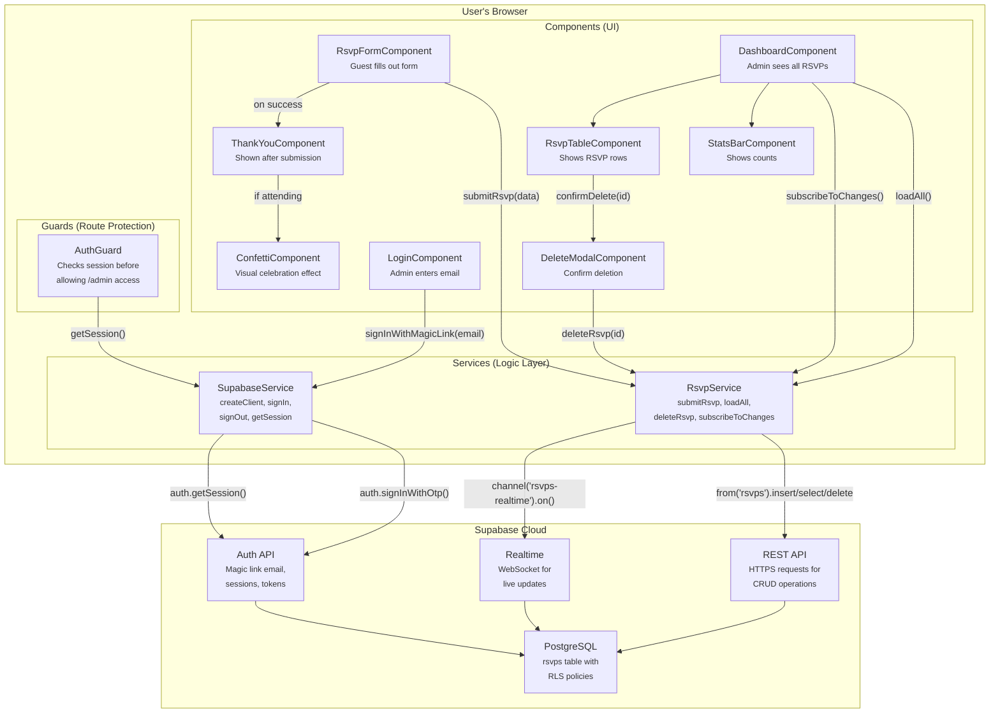

# Angular Deep-Dive — Wedding RSVP Project

Everything explained: **what** each concept is, **why** it exists, and **how** it connects to your current code.

---

## Part 1: Prerequisites

### 1.1 TypeScript — Why Angular Forces You to Use It

**What is it?** TypeScript is JavaScript with **types**. You declare what shape your data has.

**Why does Angular use it?** Because in a large app, bugs hide in data. Look at your `admin.js`:

```javascript
// Your current code — no safety net
const guests = allRsvps.filter(r => r.is_coming).reduce((sum, r) => sum + (r.guest_count || 1), 0)
```

What if `guest_count` is accidentally a string `"3"` instead of a number `3`? JavaScript won't warn you — it'll silently concatenate strings. TypeScript catches this **before** the code runs:

```typescript
// TypeScript version — compiler yells at you if types are wrong
interface Rsvp {
  id: string;
  full_name: string;
  is_coming: boolean;
  guest_count: number;    // ← TypeScript guarantees this is a number
  comment?: string;       // ← the ? means "optional, could be undefined"
}

const guests = allRsvps
  .filter((r: Rsvp) => r.is_coming)
  .reduce((sum, r) => sum + r.guest_count, 0);  // Safe — no || 1 needed
```

> [!TIP]
> **Think of TypeScript as a spell-checker for your data.** It doesn't change how the code runs — it just catches mistakes while you're writing.

---

### 1.2 RxJS & Observables — Why Angular Doesn't Use `async/await` Everywhere

**What is it?** RxJS is a library for handling **streams of data over time**.

**Why not just use `async/await` like you do now?** Because `async/await` handles **one** response. But some things produce **multiple** values over time:

| Scenario | How many values? | Your current approach | Angular approach |
|----------|-----------------|----------------------|-----------------|
| Fetch all RSVPs once | 1 | `await supabase.from('rsvps').select('*')` | Could use `async/await` too |
| Real-time updates (new RSVP arrives) | ∞ (continuous stream) | `supabase.channel(...).on(...)` with callbacks | `Observable` — a stream you subscribe to |
| User typing in search box | ∞ (each keystroke) | `searchInput.addEventListener('input', ...)` | `Observable` with debounce |
| Auth state changes | ∞ | `supabase.auth.onAuthStateChange(callback)` | `Observable` |

**How does it work?** An Observable is like a YouTube subscription:

```typescript
// You SUBSCRIBE to a channel, and it PUSHES new data to you
this.rsvpService.rsvps$.subscribe(rsvps => {
  this.allRsvps = rsvps;  // Automatically updates every time data changes
});

// Compare to your current code where you manually re-call loadRsvps():
// supabase.channel('rsvps-realtime').on('postgres_changes', ... , () => loadRsvps())
```

> [!IMPORTANT]
> You don't need to master RxJS on day one. Start with just `subscribe()` and `pipe()`. The rest comes naturally as you build.

---

## Part 2: Angular Core Concepts — The Deep "Why"

---

### 2.1 Components — Why Angular Splits Everything Into Pieces

#### What is a Component?

A component is **a reusable piece of UI** with its own HTML, CSS, and logic bundled together. Think of it like a LEGO block.

#### The Problem It Solves

Look at your `admin.html` — it's one massive 128-line file containing:
- The login screen (lines 14–41)
- The dashboard header (lines 46–56)
- The stats bar (lines 58–80)
- The toolbar with search + filters (lines 82–91)
- The RSVP table (lines 93–115)
- The modal placeholder (line 118)
- The footer (lines 120–122)

And `admin.js` is a single 315-line file that handles ALL the logic for ALL of these. If you want to change how the stats bar looks, you have to scroll through delete logic, CSV export code, and dark mode handlers to find the right section.

**Components fix this by splitting each piece into its own isolated box:**

```
Your admin.html (128 lines, everything mixed)
        ↓ becomes ↓
├── LoginComponent         (just the login card — ~40 lines)
├── DashboardComponent     (layout shell — ~20 lines)
├── StatsBarComponent      (just the 5 stat cards — ~30 lines)
├── RsvpTableComponent     (just the table + search — ~60 lines)
└── DeleteModalComponent   (just the delete popup — ~25 lines)
```

#### How It Looks in Code

```typescript
// src/app/features/admin/stats-bar/stats-bar.component.ts

import { Component, Input } from '@angular/core';  // ← Import from Angular

@Component({
  selector: 'app-stats-bar',       // ← The HTML tag name: <app-stats-bar>
  standalone: true,                 // ← This component manages its own imports
  templateUrl: './stats-bar.component.html',   // ← Its own HTML
  styleUrls: ['./stats-bar.component.css']     // ← Its own CSS (scoped! won't leak)
})
export class StatsBarComponent {
  @Input() rsvps: Rsvp[] = [];     // ← Receives data from parent (explained below)

  // Computed values — replaces your renderStats() function
  get total(): number { return this.rsvps.length; }
  get attending(): number { return this.rsvps.filter(r => r.is_coming).length; }
  get notAttending(): number { return this.total - this.attending; }
  get totalGuests(): number {
    return this.rsvps
      .filter(r => r.is_coming)
      .reduce((sum, r) => sum + (r.guest_count || 1), 0);
  }
  get withNotes(): number { return this.rsvps.filter(r => r.comment).length; }
}
```

#### Why Not Just Use One Big File?

| Problem with one big file | How components fix it |
|--------------------------|----------------------|
| Hard to find code | Each component is a small, focused file |
| Changing one thing breaks another | CSS is **scoped** — styles in StatsBar can't affect the Table |
| Can't reuse pieces | Components are reusable: `<app-stats-bar>` can appear anywhere |
| Hard for teams to work together | Different people can work on different components |
| Everything re-renders on any change | Angular only re-renders the components whose data changed |

---

### 2.2 Templates & Data Binding — Why You Stop Writing `document.getElementById()`

#### The Problem It Solves

In your `app.js`, every UI update requires you to **manually find an element and set its value**:

```javascript
// YOUR CURRENT CODE — manual DOM manipulation
const submitBtn = document.getElementById('submit-btn')       // Find the button
const btnText = submitBtn.querySelector('.btn-text')           // Find the text span
const btnLoading = submitBtn.querySelector('.btn-loading')     // Find the loading span

// When submitting:
submitBtn.disabled = true       // Manually disable
btnText.hidden = true           // Manually hide text
btnLoading.hidden = false       // Manually show loading

// On error:
submitBtn.disabled = false      // Manually re-enable
btnText.hidden = false          // Manually show text again
btnLoading.hidden = true        // Manually hide loading again
```

That's **6 lines** just to toggle a loading state. And if you rename an ID in the HTML but forget to update the JS? Silent bug.

#### How Angular Does It Instead

Angular **binds** your HTML to your TypeScript variables. When the variable changes, the HTML updates **automatically**:

```html
<!-- Angular template — the HTML IS the source of truth -->
<button type="submit" [disabled]="isLoading">
  <span *ngIf="!isLoading">Confirm Attendance</span>
  <span *ngIf="isLoading">Sending…</span>
</button>
```

```typescript
// In your component — just flip one boolean
isLoading = false;

async onSubmit() {
  this.isLoading = true;    // ← That's it. Button disables AND text changes automatically.

  const { error } = await this.rsvpService.submitRsvp(this.formData);

  if (error) {
    this.isLoading = false;  // ← Reverts everything automatically
  }
}
```

#### The Three Types of Binding

| Syntax | Direction | What it does | Replaces from your code |
|--------|-----------|-------------|------------------------|
| `{{ value }}` | Component → HTML | Displays a value | `element.textContent = value` |
| `[property]="value"` | Component → HTML | Sets an HTML attribute | `element.disabled = true` |
| `(event)="handler()"` | HTML → Component | Listens for user action | `element.addEventListener('click', ...)` |
| `[(ngModel)]="value"` | Both ways ↔ | Two-way: typing updates the variable, variable updates the input | `input.value = x` + `input.addEventListener('input', ...)` |

**Real example — your search bar:**

```javascript
// YOUR CURRENT CODE (admin.js) — 4 lines
const searchInput = document.getElementById('search-input')
searchInput.addEventListener('input', () => {
  searchQuery = searchInput.value.trim()
  renderTable()   // manually re-render
})
```

```html
<!-- ANGULAR VERSION — 1 line in the template -->
<input [(ngModel)]="searchQuery" placeholder="Search by name…" />
<!-- The table automatically re-renders because Angular detects searchQuery changed -->
```

---

### 2.3 Directives — Why You Stop Writing `innerHTML`

#### The Problem It Solves

Look at how you render the RSVP table in `admin.js`:

```javascript
// YOUR CURRENT CODE — building HTML as a string 😬
tbody.innerHTML = filtered.map((r, i) => `
  <tr>
    <td class="row-num">${i + 1}</td>
    <td><strong>${esc(r.full_name || r.name || '')}</strong></td>
    <td><span class="badge ${r.is_coming ? 'badge-yes' : 'badge-no'}">
      ${r.is_coming ? '✓ Yes' : '✗ No'}
    </span></td>
    ...
  </tr>
`).join('')
```

This approach has problems:
- **XSS risk** — you have to manually call `esc()` on every value to prevent injection
- **No click handlers** — you have to re-attach event listeners after every `innerHTML` update
- **Hard to read** — HTML mixed inside template literals inside JavaScript

#### How Angular Does It Instead

Angular gives you **directives** — special attributes that control the template:

```html
<!-- Angular template — clean, safe, readable -->
<tr *ngFor="let rsvp of filteredRsvps; let i = index">
  <td class="row-num">{{ i + 1 }}</td>
  <td><strong>{{ rsvp.full_name }}</strong></td>
  <td>
    <span class="badge" [ngClass]="rsvp.is_coming ? 'badge-yes' : 'badge-no'">
      {{ rsvp.is_coming ? '✓ Yes' : '✗ No' }}
    </span>
  </td>
  <td>
    <button (click)="confirmDelete(rsvp.id)">✕</button>
    <!-- ^ click handler is right here, no re-attaching needed -->
  </td>
</tr>
```

| Directive | What it does | Replaces |
|-----------|-------------|---------|
| `*ngFor="let item of items"` | Loop over array, create HTML for each | `.map().join('')` with `innerHTML` |
| `*ngIf="condition"` | Show/hide element based on condition | `element.hidden = true/false` |
| `[ngClass]="{'class': condition}"` | Add/remove CSS classes dynamically | Manual `classList.toggle()` |
| `[ngStyle]="{ color: myColor }"` | Set inline styles dynamically | `element.style.color = myColor` |

> [!NOTE]
> Angular **automatically escapes** all `{{ }}` output. You never need an `esc()` function — XSS protection is built in.

---

### 2.4 Reactive Forms — Why You Stop Validating Manually

#### The Problem It Solves

Your `app.js` validates the form field-by-field with manual checks:

```javascript
// YOUR CURRENT CODE — manual validation
let valid = true

if (!fullName) {
  showError(form.full_name, 'Please enter your name')    // Custom error function
  valid = false
}
if (!coming) {
  showError(document.getElementById('radio-group'), 'Please select one')
  valid = false
}
if (email && !/^[^\s@]+@[^\s@]+\.[^\s@]+$/.test(email)) {
  showError(form.email, 'Please enter a valid email')
  valid = false
}
if (!valid) return
```

This is fragile: add a new field and you have to remember to add validation, create the error message, handle the shake animation, and clear it later.

#### How Angular Does It Instead

Angular's **Reactive Forms** module lets you declare all validation rules **upfront** in one place:

```typescript
import { FormBuilder, FormGroup, Validators } from '@angular/forms';

export class RsvpFormComponent {

  rsvpForm: FormGroup;

  constructor(private fb: FormBuilder) {
    // ─── Declare all validation rules in ONE place ────────────
    this.rsvpForm = this.fb.group({
      full_name:    ['', Validators.required],                         // Required
      email:        ['', Validators.email],                            // Built-in email regex
      coming:       ['', Validators.required],                         // Required
      guest_count:  [1, [Validators.min(1), Validators.max(6)]],       // Between 1-6
      song_request: [''],                                              // Optional — no validators
      comment:      ['']                                               // Optional
    });
  }

  onSubmit() {
    if (this.rsvpForm.invalid) {
      this.rsvpForm.markAllAsTouched();  // ← Shows ALL errors at once
      return;
    }

    // Form data is already typed and validated
    const data = this.rsvpForm.value;
    this.rsvpService.submitRsvp(data);
  }
}
```

```html
<!-- Template — errors show automatically -->
<div class="field">
  <label for="full-name">Full Name</label>
  <input id="full-name" formControlName="full_name" />

  <!-- This message appears only when the field is touched AND empty -->
  <p class="field-error"
     *ngIf="rsvpForm.get('full_name')?.touched && rsvpForm.get('full_name')?.hasError('required')">
    Please enter your name
  </p>
</div>
```

#### Why This Is Better

| Manual validation (your current code) | Reactive Forms (Angular) |
|---------------------------------------|--------------------------|
| You check each field one by one | All rules declared upfront in the `FormGroup` |
| You build error `<p>` elements with JS | Error messages live in the HTML template |
| You manually call `clearErrors()` | Errors clear automatically when the user types |
| Adding a field = editing JS + HTML | Adding a field = one line in `fb.group()` |
| No type safety on form values | `this.rsvpForm.value` is typed |

---

### 2.5 Services & Dependency Injection — The Most Important Concept

#### What is a Service?

A **service** is a regular TypeScript class that holds **logic you want to share** across multiple components. It does NOT have HTML or CSS — it's pure logic.

#### Why Do You Need Services? The Problem.

Right now, your Supabase calls are scattered directly inside `app.js` and `admin.js`:

```javascript
// In app.js — RSVP submission
const { error } = await supabase.from('rsvps').insert({ ... })

// In admin.js — loading RSVPs
const { data, error } = await supabase.from('rsvps').select('*').order('created_at', ...)

// In admin.js — deleting an RSVP
const { error } = await supabase.from('rsvps').delete().eq('id', id)

// In admin.js — login
const { error } = await supabase.auth.signInWithOtp({ email, ... })

// In admin.js — logout
await supabase.auth.signOut()
```

**The problems:**
1. **Duplication** — If you need to load RSVPs from a new page, you copy-paste the Supabase query
2. **Scattered logic** — Auth logic, data logic, and UI logic are all mixed in the same files
3. **Hard to test** — You can't test the Supabase logic without also loading the full HTML page
4. **Hard to change** — If you switch from Supabase to Firebase tomorrow, you'd have to edit every file

#### How Services Fix This

A service creates a **single source of truth** for each type of logic:

```
BEFORE (Vanilla JS):                    AFTER (Angular Services):
┌─────────────┐                          
│   app.js    │  supabase.insert()       ┌─────────────────────┐
│             │  supabase.auth...        │   RsvpService       │ ← ALL rsvp data logic
└─────────────┘                          │   .submitRsvp()     │
                                         │   .loadAll()        │
┌─────────────┐                          │   .deleteRsvp()     │
│  admin.js   │  supabase.select()       │   .subscribeToChanges() │
│             │  supabase.delete()       └─────────────────────┘
│             │  supabase.auth...                    │
└─────────────┘                          ┌───────────────────────┐
                                         │   SupabaseService     │ ← ALL Supabase setup
                                         │   .signInWithMagicLink() │
                                         │   .signOut()          │
                                         │   .getSession()       │
                                         └───────────────────────┘
```

Now, **any component** that needs RSVP data just asks for the service:

```typescript
// The RsvpFormComponent (replaces app.js)
export class RsvpFormComponent {
  constructor(private rsvpService: RsvpService) {}
  //                  ↑ Angular automatically gives you the service

  async onSubmit() {
    const { error } = await this.rsvpService.submitRsvp(formData);
    //                      ↑ The component doesn't know or care HOW this works
  }
}

// The DashboardComponent (replaces admin.js)
export class DashboardComponent {
  constructor(private rsvpService: RsvpService) {}
  //                  ↑ SAME service instance — shared data!

  async ngOnInit() {
    await this.rsvpService.loadAll();
    this.rsvpService.subscribeToChanges();
  }
}
```

#### What is Dependency Injection (DI)?

Notice that you never write `new RsvpService()`. You just declare it in the constructor and Angular **injects** it for you. That's Dependency Injection.

**Why does Angular do this instead of letting you `new` it yourself?**

```typescript
// WITHOUT DI — you'd have to do this:
export class DashboardComponent {
  private supabaseService = new SupabaseService();     // Creates a NEW Supabase client
  private rsvpService = new RsvpService(this.supabaseService); // Creates a NEW service

  // Problem: every component creates its OWN separate instances
  // The RSVP form's service and the dashboard's service are DIFFERENT objects
  // They don't share data!
}

// WITH DI — Angular creates ONE instance and shares it:
export class DashboardComponent {
  constructor(private rsvpService: RsvpService) {}
  // ↑ Angular gives you the SAME RsvpService that every other component gets
  // When the form submits a new RSVP, the dashboard's service already has it
}
```

> [!IMPORTANT]
> **The key insight:** `providedIn: 'root'` in a service means "create exactly **one** instance of this service for the entire app and share it everywhere." This is called a **singleton**. It's how your dashboard can automatically see new RSVPs submitted from the form — they share the same service.

#### Full Service Code with Annotations

```typescript
// src/app/core/services/rsvp.service.ts

import { Injectable } from '@angular/core';
import { BehaviorSubject, Observable } from 'rxjs';
import { SupabaseService } from './supabase.service';
import { Rsvp } from '../models/rsvp.model';

@Injectable({ providedIn: 'root' })
//            ↑ This tells Angular: "Create ONE instance, share it with the whole app"
export class RsvpService {

  // BehaviorSubject is like a variable that components can "watch" for changes
  // When you call .next(newData), every subscriber immediately gets the new data
  private rsvpsSubject = new BehaviorSubject<Rsvp[]>([]);

  // rsvps$ is the public, read-only version that components subscribe to
  // The $ suffix is an Angular convention meaning "this is an Observable (a stream)"
  public rsvps$: Observable<Rsvp[]> = this.rsvpsSubject.asObservable();

  constructor(private supabaseService: SupabaseService) {}
  //          ↑ This service DEPENDS on SupabaseService
  //            Angular injects the SupabaseService automatically

  // ─── Used by: RsvpFormComponent ────────────────────────────
  // Purpose: Insert a new RSVP row into the database
  // Replaces: The supabase.from('rsvps').insert({...}) call in app.js line 61-70
  async submitRsvp(rsvp: Partial<Rsvp>): Promise<{ error: any }> {
    const { error } = await this.supabaseService.supabase
      .from('rsvps')
      .insert(rsvp);
    return { error };
  }

  // ─── Used by: DashboardComponent ──────────────────────────
  // Purpose: Fetch all RSVPs and push them into the stream
  // Replaces: The loadRsvps() function in admin.js line 110-124
  async loadAll(): Promise<void> {
    const { data, error } = await this.supabaseService.supabase
      .from('rsvps')
      .select('*')
      .order('created_at', { ascending: false });

    if (!error && data) {
      this.rsvpsSubject.next(data);
      // ↑ This triggers every component that subscribes to rsvps$
      //   to re-render with the new data — automatically!
    }
  }

  // ─── Used by: DeleteModalComponent ─────────────────────────
  // Purpose: Delete one RSVP, then refresh the list
  // Replaces: The supabase.from('rsvps').delete().eq('id', id) in admin.js line 253
  async deleteRsvp(id: string): Promise<{ error: any }> {
    const { error } = await this.supabaseService.supabase
      .from('rsvps')
      .delete()
      .eq('id', id);

    if (!error) {
      await this.loadAll();  // Refresh the list after deletion
    }
    return { error };
  }

  // ─── Used by: DashboardComponent (on init) ─────────────────
  // Purpose: Listen for real-time database changes via WebSocket
  // Replaces: The subscribeRealtime() function in admin.js line 127-139
  subscribeToChanges() {
    return this.supabaseService.supabase
      .channel('rsvps-realtime')
      .on('postgres_changes',
        { event: '*', schema: 'public', table: 'rsvps' },
        () => this.loadAll()
      )
      .subscribe();
  }
}
```

---

### 2.6 Routing — Why You Have One `index.html` Instead of Two

#### The Problem It Solves

Right now you have two separate HTML files:
- `index.html` — the RSVP form for guests
- `admin.html` — the dashboard for you

This means:
- Navigating between them is a **full page reload**
- You duplicate the `<head>`, fonts, CSS links in both files
- There's no shared layout (navbar, footer)

#### How Angular Routing Works

Angular is a **Single Page Application (SPA)**. There's only ONE `index.html`. Angular swaps components in and out as the URL changes — no page reload:

```
URL: yoursite.com/           →  Shows RsvpFormComponent
URL: yoursite.com/admin       →  Shows DashboardComponent (if logged in)
URL: yoursite.com/admin/login →  Shows LoginComponent
```

```typescript
// src/app/app.routes.ts — the routing configuration

import { Routes } from '@angular/router';
import { authGuard } from './core/guards/auth.guard';

export const routes: Routes = [

  // Route 1: The guest-facing RSVP form
  // When someone visits yoursite.com/, they see the form
  {
    path: '',
    loadComponent: () =>
      import('./features/rsvp/rsvp-form/rsvp-form.component')
        .then(m => m.RsvpFormComponent)
    // ↑ "Lazy loading" — this component's code is only downloaded
    //   when someone visits this page. Faster initial load.
  },

  // Route 2: Admin login page
  // When someone visits yoursite.com/admin/login
  {
    path: 'admin/login',
    loadComponent: () =>
      import('./features/admin/login/login.component')
        .then(m => m.LoginComponent)
  },

  // Route 3: Admin dashboard (PROTECTED)
  // When someone visits yoursite.com/admin
  {
    path: 'admin',
    canActivate: [authGuard],
    // ↑ This runs BEFORE the page loads. If not logged in,
    //   the guard redirects to /admin/login. The dashboard
    //   component never even loads.
    loadComponent: () =>
      import('./features/admin/dashboard/dashboard.component')
        .then(m => m.DashboardComponent)
  },

  // Route 4: Catch-all — any unknown URL goes to the form
  { path: '**', redirectTo: '' }
];
```

The root component's HTML is simple — it just has a placeholder where routes render:

```html
<!-- src/app/app.component.html -->
<router-outlet></router-outlet>
<!-- ↑ Angular replaces this with the component that matches the current URL -->
```

---

### 2.7 Guards — Why You Don't Check Auth Inside Components

#### The Problem It Solves

In your `admin.js`, the first thing that runs is an auth check:

```javascript
// YOUR CURRENT CODE (admin.js line 45-50)
const { data: { session } } = await supabase.auth.getSession()
if (session) {
  showDashboard()     // Show the dashboard
} else {
  loginScreen.hidden = false   // Show the login form
}
```

This works, but the dashboard HTML **already exists in the page** — it's just hidden. A tech-savvy person could open DevTools, remove `hidden`, and see the dashboard structure (though the data wouldn't load without auth due to RLS).

#### How Guards Fix This

A **guard** is a function that runs **before** a route loads. If it returns `false`, the component **never loads at all**:

```typescript
// src/app/core/guards/auth.guard.ts

import { inject } from '@angular/core';
import { CanActivateFn, Router } from '@angular/router';
import { SupabaseService } from '../services/supabase.service';

// This function runs BEFORE DashboardComponent loads
export const authGuard: CanActivateFn = async () => {

  // inject() is how you get services inside a function (not a class)
  const supabase = inject(SupabaseService);
  const router = inject(Router);

  const { data: { session } } = await supabase.getSession();

  if (session) {
    return true;
    // ↑ "Yes, the user is allowed to see this page. Load the component."
  }

  router.navigate(['/admin/login']);
  return false;
  // ↑ "No, redirect them to login. The DashboardComponent will NOT load."
};
```

This is better because:
- The dashboard code **doesn't even download** until you're authenticated (lazy loading + guard)
- No hidden HTML in the DOM for someone to inspect
- The auth check is **reusable** — add `canActivate: [authGuard]` to any route you want to protect

---

### 2.8 Pipes — Why You Stop Writing Helper Functions for Formatting

#### The Problem It Solves

Your `admin.js` has two helper functions for formatting display data:

```javascript
// YOUR CURRENT CODE — helper functions
function esc(str) {
  if (!str) return ''
  return str.replace(/&/g, '&amp;').replace(/</g, '&lt;')...
}

function formatDate(iso) {
  if (!iso) return '—'
  return new Date(iso).toLocaleDateString('en-GB', {
    day: '2-digit', month: 'short', year: 'numeric',
    hour: '2-digit', minute: '2-digit'
  })
}
```

You call these inside your template string: `${formatDate(r.created_at)}`, `${esc(r.full_name)}`

#### How Angular Does It Instead

Angular has **pipes** — functions you apply directly in the HTML template using the `|` symbol:

```html
<!-- You don't need esc() — Angular auto-escapes everything in {{ }} -->
<td>{{ rsvp.full_name }}</td>

<!-- You don't need formatDate() — Angular has a built-in date pipe -->
<td>{{ rsvp.created_at | date:'dd MMM yyyy, HH:mm' }}</td>

<!-- Other useful built-in pipes: -->
<td>{{ rsvp.guest_count | number }}</td>          <!-- Formats numbers -->
<td>{{ rsvp.full_name | uppercase }}</td>          <!-- SANDRA -->
<td>{{ rsvp.full_name | titlecase }}</td>          <!-- Sandra Mark -->
<td>{{ somePrice | currency:'EGP' }}</td>           <!-- EGP 1,500.00 -->
```

> [!NOTE]
> The `esc()` function is completely unnecessary in Angular. All `{{ }}` interpolation is automatically HTML-escaped. This is a major security benefit.

---

### 2.9 Lifecycle Hooks — Why You Don't Write Top-Level `await`

#### The Problem It Solves

In your `admin.js`, code runs as soon as the file loads:

```javascript
// YOUR CURRENT CODE — top-level await (admin.js line 45)
const { data: { session } } = await supabase.auth.getSession()
if (session) {
  showDashboard()
}
```

This works in a `<script type="module">`, but in Angular, components are **classes** that can be created and destroyed as the user navigates. You need a way to say "run this code when the component appears" and "clean up when it disappears."

#### How Angular Does It

Angular provides **lifecycle hooks** — methods on your component that Angular calls at specific moments:

```typescript
export class DashboardComponent implements OnInit, OnDestroy {
  // ↑ implements = "I promise to provide these methods"

  private realtimeSubscription: any;

  constructor(private rsvpService: RsvpService) {}

  // ─── ngOnInit: Called ONCE when the component first appears ──────
  // This replaces all your top-level code that runs "on page load"
  async ngOnInit() {
    await this.rsvpService.loadAll();           // Load data
    this.realtimeSubscription =
      this.rsvpService.subscribeToChanges();    // Start real-time listener
  }

  // ─── ngOnDestroy: Called when the component is removed from the page ──
  // This is for CLEANUP — unsubscribing, removing listeners
  // Without this, the real-time subscription keeps running in the background!
  ngOnDestroy() {
    if (this.realtimeSubscription) {
      this.realtimeSubscription.unsubscribe();  // Stop listening
    }
  }
}
```

| Lifecycle Hook | When it runs | Use it for |
|---------------|-------------|-----------|
| `ngOnInit()` | Component first appears | Loading data, starting subscriptions |
| `ngOnDestroy()` | Component is removed | Cleaning up subscriptions, timers |
| `ngOnChanges()` | An `@Input()` value changes | Reacting to parent data changes |
| `ngAfterViewInit()` | After the HTML is rendered | DOM manipulation (rare in Angular) |

---

### 2.10 Environment Files — Why You Don't Hardcode API Keys

#### The Problem It Solves

Your `config.js` has your Supabase credentials right in the source code:

```javascript
// YOUR CURRENT CODE — one config for everything
export const SUPABASE_URL = 'https://xoonljccypiznrzweppa.supabase.co'
export const SUPABASE_ANON = 'sb_publishable_7Wue2K1H...'
```

What if you want different databases for development vs. production? You'd have to manually change the values before deploying.

#### How Angular Does It

Angular has **environment files** — different configs for different builds:

```typescript
// src/environments/environment.ts (DEVELOPMENT — used with 'ng serve')
export const environment = {
  production: false,
  supabase: {
    url: 'https://dev-project.supabase.co',      // Dev database
    anonKey: 'dev-anon-key'
  }
};

// src/environments/environment.prod.ts (PRODUCTION — used with 'ng build')
export const environment = {
  production: true,
  supabase: {
    url: 'https://xoonljccypiznrzweppa.supabase.co',  // Real database
    anonKey: 'real-anon-key'
  }
};
```

Your code always imports from the same place:

```typescript
import { environment } from '../../../environments/environment';

// Angular CLI automatically swaps the file depending on the build:
//   ng serve          → uses environment.ts
//   ng build --prod   → uses environment.prod.ts
```

---

## Part 3: Full Project Structure — Every File Explained

```
wedding-rsvp/
├── src/
│   ├── app/
│   │   ├── core/                          # "Core" = singleton logic used everywhere
│   │   │   │                              # Rule: imported ONCE in the root, shared app-wide
│   │   │   │
│   │   │   ├── services/
│   │   │   │   ├── supabase.service.ts    # WHY: Centralizes the Supabase client creation.
│   │   │   │   │                          #       Without this, every component would create
│   │   │   │   │                          #       its own createClient() — wasteful and buggy.
│   │   │   │   │                          # REPLACES: config.js
│   │   │   │   │
│   │   │   │   └── rsvp.service.ts        # WHY: All database operations in ONE place.
│   │   │   │                              #       Any component calls rsvpService.loadAll()
│   │   │   │                              #       instead of writing raw Supabase queries.
│   │   │   │                              # REPLACES: The supabase.from() calls in app.js & admin.js
│   │   │   │
│   │   │   ├── guards/
│   │   │   │   └── auth.guard.ts          # WHY: Protects admin routes. Runs BEFORE the
│   │   │   │                              #       component loads — if not logged in, the
│   │   │   │                              #       dashboard code never even downloads.
│   │   │   │                              # REPLACES: if (session) { showDashboard() }
│   │   │   │
│   │   │   └── models/
│   │   │       └── rsvp.model.ts          # WHY: Defines the exact shape of an RSVP object.
│   │   │                                  #       TypeScript uses this to catch typos like
│   │   │                                  #       r.fullname (should be r.full_name)
│   │   │                                  # REPLACES: nothing — you didn't have this safety before
│   │   │
│   │   ├── features/                      # Each major section of the app lives here
│   │   │   │
│   │   │   ├── rsvp/                      #  ── THE GUEST-FACING PAGE ──
│   │   │   │   │
│   │   │   │   ├── rsvp-form/             # WHY IT'S ITS OWN COMPONENT:
│   │   │   │   │   ├── rsvp-form.component.ts    #   The form has its own validation logic,
│   │   │   │   │   ├── rsvp-form.component.html  #   form state, loading state, etc.
│   │   │   │   │   └── rsvp-form.component.css   #   CSS is SCOPED — styles apply only here
│   │   │   │   │                          # REPLACES: index.html + app.js (form part)
│   │   │   │   │
│   │   │   │   ├── thank-you/             # WHY IT'S SEPARATE: It replaces the form after
│   │   │   │   │   ├── thank-you.component.ts    #   submission. In Angular, it's cleaner to
│   │   │   │   │   └── thank-you.component.html  #   switch components than hide/show divs
│   │   │   │   │                          # REPLACES: <div id="thankyou" hidden>
│   │   │   │   │
│   │   │   │   └── confetti/              # WHY IT'S SEPARATE: It's a visual effect with
│   │   │   │       ├── confetti.component.ts     #   its own animation logic. Could be reused
│   │   │   │       └── confetti.component.css    #   on any page.
│   │   │   │                              # REPLACES: launchConfetti() function
│   │   │   │
│   │   │   └── admin/                     #  ── THE ADMIN DASHBOARD ──
│   │   │       │
│   │   │       ├── login/                 # REPLACES: <div id="login-screen"> + magic link logic
│   │   │       │   ├── login.component.ts
│   │   │       │   ├── login.component.html
│   │   │       │   └── login.component.css
│   │   │       │
│   │   │       ├── dashboard/             # REPLACES: <div id="dashboard"> — the layout shell
│   │   │       │   ├── dashboard.component.ts     #   Contains the header, and hosts the child
│   │   │       │   ├── dashboard.component.html   #   components below via <app-stats-bar>,
│   │   │       │   └── dashboard.component.css    #   <app-rsvp-table>, etc.
│   │   │       │
│   │   │       ├── stats-bar/             # WHY SEPARATE: The stats have their own
│   │   │       │   ├── stats-bar.component.ts     #   computed values (total, attending, etc).
│   │   │       │   ├── stats-bar.component.html   #   Receives RSVP data as @Input() from parent.
│   │   │       │   └── stats-bar.component.css
│   │   │       │                          # REPLACES: renderStats() function + stat-card HTML
│   │   │       │
│   │   │       ├── rsvp-table/            # WHY SEPARATE: The table has filtering, searching,
│   │   │       │   ├── rsvp-table.component.ts    #   and rendering logic. Keeping it separate
│   │   │       │   ├── rsvp-table.component.html  #   means the stats bar doesn't re-render
│   │   │       │   └── rsvp-table.component.css   #   when you type in the search box.
│   │   │       │                          # REPLACES: renderTable() + search + filter logic
│   │   │       │
│   │   │       └── delete-modal/          # WHY SEPARATE: Modals are inherently reusable.
│   │   │           ├── delete-modal.component.ts  #   This can be triggered from anywhere.
│   │   │           ├── delete-modal.component.html#   No more innerHTML injection.
│   │   │           └── delete-modal.component.css
│   │   │                                  # REPLACES: confirmDelete() and its innerHTML
│   │   │
│   │   ├── shared/                        # Pieces used by BOTH features
│   │   │   └── components/
│   │   │       └── navbar/                # WHY: The nav is the same on both pages.
│   │   │           ├── navbar.component.ts#   Instead of duplicating it in two HTML files,
│   │   │           └── navbar.component.html  #   you write it once and reuse it.
│   │   │
│   │   ├── app.component.ts               # The ROOT — just a shell that holds <router-outlet>
│   │   ├── app.component.html             #   Think of it as the <body> wrapper
│   │   ├── app.routes.ts                  # URL → Component mapping (explained in 2.6)
│   │   └── app.config.ts                  # Providers: tells Angular which services to create
│   │
│   ├── environments/
│   │   ├── environment.ts                 # Dev config (explained in 2.10)
│   │   └── environment.prod.ts            # Prod config
│   │
│   ├── assets/
│   │   └── images/
│   │       └── venue.png                  # Static files served as-is
│   │
│   ├── styles.css                         # GLOBAL styles (fonts, CSS variables, resets)
│   │                                      # Component-specific styles go in their own .css files
│   ├── index.html                         # The only HTML file — just a shell with <app-root>
│   └── main.ts                            # Bootstrap: starts the Angular framework
│
├── angular.json                           # Angular CLI configuration
├── package.json                           # Dependencies (Angular, Supabase, RxJS)
└── tsconfig.json                          # TypeScript compiler settings
```

---

## Part 4: The Complete Connection Map

### How Data Flows Through the App



### Security — What Happens at Each Layer

| Layer | What it protects | How |
|-------|-----------------|-----|
| **AuthGuard** (Angular) | Prevents loading the dashboard component | Checks `getSession()` before route loads |
| **Supabase RLS** (Database) | Prevents unauthorized data access even if someone bypasses the UI | `CREATE POLICY "Auth users can read" ON rsvps FOR SELECT USING (auth.role() = 'authenticated')` |
| **Anon Key** (Supabase) | Limits API access to defined policies | The anon key can only do what RLS policies allow — anyone can INSERT, only auth users can SELECT/DELETE |

> [!IMPORTANT]
> **Two layers of security work together:** The Angular guard is for UX (don't show the page). The Supabase RLS is for actual security (don't return the data). Never rely on only one.

---

## Part 5: Build Order — What to Build First & What Comes Next

### The Exact Sequence — Just Follow This

Here's the exact order to code each file. **Don't skip ahead** — each one depends on the one before it.

```
 ① ng new wedding-rsvp                    ← Create the project
 │
 ② environment.ts                         ← Put your Supabase URL + key here
 │
 ③ rsvp.model.ts                          ← Define what an RSVP looks like
 │
 ④ supabase.service.ts                    ← Connect to Supabase (uses ②)
 │
 ⑤ rsvp.service.ts                        ← CRUD operations for RSVPs (uses ③ + ④)
 │
 ⑥ auth.guard.ts                          ← Block /admin if not logged in (uses ④)
 │
 ⑦ app.routes.ts                          ← Map URLs to pages (uses ⑥)
 │
 ├─── GUEST PAGE (simpler — start here) ──────────────────────
 │
 ⑧ RsvpFormComponent                      ← The form guests fill out (uses ⑤)
 │
 ⑨ ThankYouComponent                      ← "Thank you" after submit (uses ⑧)
 │
 ⑩ ConfettiComponent                      ← Celebration animation
 │
 │   ✅ GUEST PAGE DONE — guests can submit RSVPs
 │
 ├─── ADMIN PAGE (complex — build second) ────────────────────
 │
 ⑪ LoginComponent                         ← Magic link login (uses ④)
 │
 ⑫ DashboardComponent                     ← The layout shell (uses ⑤)
 │
 ⑬ StatsBarComponent                      ← The 5 stat cards (uses ⑫ data)
 │
 ⑭ RsvpTableComponent                     ← Table + search + filters (uses ⑫ data)
 │
 ⑮ DeleteModalComponent                   ← Confirm delete popup (uses ⑤ + ⑭)
 │
 │   ✅ ADMIN PAGE DONE — you can manage RSVPs
 │
 ├─── POLISH ─────────────────────────────────────────────────
 │
 ⑯ Dark mode, CSV export, mobile nav, error handling
 │
 └── ✅ APP COMPLETE
```

### Why This Order? (Short Version)

| You build… | Because it needs… | And it unlocks… |
|---|---|---|
| ② `environment.ts` | Nothing | ④ SupabaseService needs the URL/key |
| ③ `rsvp.model.ts` | Nothing | ⑤ RsvpService needs the data types |
| ④ `supabase.service.ts` | ② environment | ⑤ ⑥ ⑪ — everything that talks to Supabase |
| ⑤ `rsvp.service.ts` | ③ model + ④ supabase | ⑧ ⑫ ⑮ — everything that reads/writes RSVPs |
| ⑥ `auth.guard.ts` | ④ supabase | ⑦ routes — protects the admin page |
| ⑦ `app.routes.ts` | ⑥ guard | All page components — they need routes to render in |
| ⑧ `RsvpFormComponent` | ⑤ rsvpService | The guest-facing page works |
| ⑪ `LoginComponent` | ④ supabase | You can log in to test the dashboard |
| ⑫ `DashboardComponent` | ⑤ rsvpService + ⑪ login | ⑬ ⑭ ⑮ — child components get data from it |
| ⑬ `StatsBarComponent` | ⑫ gives it data | Shows the stat cards |
| ⑭ `RsvpTableComponent` | ⑫ gives it data | Shows the RSVP list |
| ⑮ `DeleteModalComponent` | ⑤ rsvpService + ⑭ table | Can delete RSVPs |

> [!IMPORTANT]
> **Why guest page before admin page?** The guest page is simpler (1 service call, no auth, no real-time). You practice Angular basics (forms, binding, components) on something easy first, then tackle the complex dashboard with confidence.

### Why Does the Order Matter? (Long Version)

You can't build a house starting from the roof. Each piece in an Angular app **depends** on pieces below it:

```
    ┌─────────────────────────────────────┐
    │  Step 7: Polish & Deploy            │  ← Can't polish what doesn't exist
    ├─────────────────────────────────────┤
    │  Step 6: Admin Dashboard Feature    │  ← Needs auth, services, routing
    ├─────────────────────────────────────┤
    │  Step 5: RSVP Form Feature          │  ← Needs services & routing
    ├─────────────────────────────────────┤
    │  Step 4: Routing & Guards           │  ← Needs services for auth check
    ├─────────────────────────────────────┤
    │  Step 3: Services (Supabase + RSVP) │  ← Needs model & environment
    ├─────────────────────────────────────┤
    │  Step 2: Models & Environment       │  ← Needs the project to exist
    ├─────────────────────────────────────┤
    │  Step 1: Project Setup (ng new)     │  ← Foundation
    └─────────────────────────────────────┘
```

---

### Step 1: Project Setup — Create the Angular App

**What you do:** Run the Angular CLI to scaffold the project.

**Why this is first:** Everything else lives inside this structure. Without it you have nowhere to write code.

```bash
# Install Angular CLI globally (one-time)
npm install -g @angular/cli

# Create the project
ng new wedding-rsvp --standalone --routing --style=css --skip-tests
#       ↑ name       ↑ modern        ↑ sets     ↑ CSS      ↑ skip test
#                      components      up router   not SCSS    files for now

# Go into the project
cd wedding-rsvp

# Install Supabase client
npm install @supabase/supabase-js

# Run the dev server to make sure it works
ng serve
# → Opens at http://localhost:4200
```

**What you should see:** The default Angular welcome page. This confirms:
- Node.js and npm are working ✅
- Angular CLI is installed ✅
- The dev server compiles and runs ✅

**What to do next:** Delete the default content in `app.component.html` (the Angular logo and links) and replace it with just `<router-outlet></router-outlet>`.

**Before moving on, also:**
- Copy your `venue.png` into `src/assets/images/`
- Copy your global CSS variables and font imports from `style.css` into `src/styles.css`
- Create the folder structure:
  ```
  src/app/core/services/
  src/app/core/guards/
  src/app/core/models/
  src/app/features/rsvp/
  src/app/features/admin/
  src/app/shared/components/
  ```

> [!TIP]
> You can create components automatically: `ng generate component features/rsvp/rsvp-form` — the CLI creates the `.ts`, `.html`, `.css`, and `.spec.ts` files for you.

---

### Step 2: Models & Environment — Define Your Data Shape

**What you do:** Create the TypeScript interface for RSVP data and set up environment files.

**Why this is second:** Services (Step 3) need to know what shape the data has. Environment files tell services where Supabase lives. Without these, you can't write the services.

#### 2a. The RSVP Model

```typescript
// src/app/core/models/rsvp.model.ts

export interface Rsvp {
  id: string;
  full_name: string;
  phone?: string;         // ? = optional
  email?: string;
  is_coming: boolean;
  guest_count: number;
  side?: 'bride' | 'groom';
  relationship?: string;
  dietary_needs?: string;
  song_request?: string;
  comment?: string;
  needs_transport?: boolean;
  table_number?: number;
  created_at: string;
}
```

**Why this matters now:** Every service method, every component, and every template will reference `Rsvp`. If you create the model first, TypeScript helps you everywhere else — autocomplete works, typos are caught instantly.

#### 2b. Environment Files

```typescript
// src/environments/environment.ts
export const environment = {
  production: false,
  supabase: {
    url: 'https://xoonljccypiznrzweppa.supabase.co',
    anonKey: 'your-anon-key-here'
  },
  wedding: {
    date: new Date('2025-06-07T17:00:00'),
    bride: 'Sandra',
    groom: 'Mark'
  }
};
```

**Why this matters now:** The `SupabaseService` (Step 3) imports from here. Without the URL and key, the service can't connect to anything.

---

### Step 3: Services — The Brain of Your App

**What you do:** Create `SupabaseService` and `RsvpService`.

**Why this is third:** Components (Steps 5–6) will call service methods. If the services don't exist yet, you can't even write `this.rsvpService.submitRsvp()` without errors. Services are the **engine** — build the engine before the body.

#### 3a. SupabaseService (build this FIRST)

```typescript
// src/app/core/services/supabase.service.ts
```

**Why first among services?** Because `RsvpService` depends on it. `RsvpService` needs `this.supabaseService.supabase` to make database calls. If `SupabaseService` doesn't exist, `RsvpService` can't compile.

**What it does:**
- Creates the Supabase client once (using environment config from Step 2)
- Provides auth methods: `signInWithMagicLink()`, `signOut()`, `getSession()`
- Every other service that needs Supabase injects this instead of calling `createClient()` themselves

**How to test it works:** Open the browser console and verify no errors. You can temporarily add a test in `app.component.ts`:

```typescript
async ngOnInit() {
  const { data } = await this.supabaseService.getSession();
  console.log('Session:', data);  // Should log { session: null } — not logged in
}
```

#### 3b. RsvpService (build this SECOND)

```typescript
// src/app/core/services/rsvp.service.ts
```

**Why second?** It depends on `SupabaseService` (built in 3a). It uses `this.supabaseService.supabase.from('rsvps')` for all database calls.

**What it does:**
- `submitRsvp()` → inserts a new RSVP (used by the form in Step 5)
- `loadAll()` → fetches all RSVPs and pushes them into `rsvps$` stream (used by dashboard in Step 6)
- `deleteRsvp()` → deletes one RSVP (used by delete modal in Step 6)
- `subscribeToChanges()` → listens for real-time updates (used by dashboard in Step 6)

**How to test it works:** Temporarily subscribe to `rsvps$` in `app.component.ts`:

```typescript
async ngOnInit() {
  await this.rsvpService.loadAll();
  this.rsvpService.rsvps$.subscribe(data => console.log('RSVPs:', data));
  // Should log your existing RSVP data from Supabase
}
```

> [!IMPORTANT]
> **Don't skip testing services in isolation!** If the services work correctly, everything built on top of them will work. If you discover a bug later, you'll know it's in the component, not the service.

---

### Step 4: Routing & Guards — Set Up Navigation

**What you do:** Define routes and create the `AuthGuard`.

**Why this is fourth:** You need services from Step 3 to exist (the guard calls `SupabaseService.getSession()`). And you need routes defined before building page components — otherwise where do they render?

#### 4a. Define Routes

```typescript
// src/app/app.routes.ts

export const routes: Routes = [
  { path: '', loadComponent: () => import('...').then(m => m.RsvpFormComponent) },
  { path: 'admin/login', loadComponent: () => import('...').then(m => m.LoginComponent) },
  { path: 'admin', canActivate: [authGuard], loadComponent: () => import('...').then(m => m.DashboardComponent) },
  { path: '**', redirectTo: '' }
];
```

**Why now?** The routes reference components that don't exist yet — that's OK. Angular uses `loadComponent` with dynamic `import()`, which means it won't try to load them until someone visits that URL. You can define the routes now and build the components next.

#### 4b. Create AuthGuard

```typescript
// src/app/core/guards/auth.guard.ts
```

**Why now?** The guard depends on `SupabaseService` (Step 3a ✅). The `/admin` route depends on this guard. Building it now means when you create the `DashboardComponent` in Step 6, the route protection is already in place.

**How to test it works:**
1. Visit `http://localhost:4200/admin` — should redirect to `/admin/login`
2. The guard is working if you see the login URL (even though the login page doesn't exist yet, you'll see a blank page at the right URL)

---

### Step 5: RSVP Form Feature — The Guest-Facing Page

**What you do:** Build the components guests interact with: the form, thank-you screen, and confetti.

**Why this is fifth (not earlier)?** Because the form calls `this.rsvpService.submitRsvp()` — which needs `RsvpService` (Step 3b ✅), which needs `SupabaseService` (Step 3a ✅), which needs the environment config (Step 2b ✅). The dependency chain is satisfied.

**Why the guest page before the admin page?** Because it's **simpler**:
- Only 1 service call (`submitRsvp`)
- No authentication required
- No real-time subscriptions
- No filtering/searching logic
- You can test it immediately by submitting an RSVP and checking Supabase

This lets you practice Angular fundamentals (components, forms, data binding) with a smaller scope before tackling the complex dashboard.

#### 5a. RsvpFormComponent (build this FIRST)

**What it needs:**
- Reactive Forms (FormGroup with validators)
- Call to `rsvpService.submitRsvp()`
- Loading state (`isLoading` boolean)
- Show/hide the thank-you component on success

**What you're practicing:**
- `@Component` decorator, template syntax
- `[formGroup]`, `formControlName`, `Validators`
- `*ngIf` for showing/hiding elements
- `(submit)` event binding
- `async/await` inside a component method

**How to build it:**
1. Generate: `ng generate component features/rsvp/rsvp-form`
2. Copy the form HTML structure from your `index.html` (lines 50–115)
3. Replace the raw `<input>` elements with `formControlName` bindings
4. Replace the `addEventListener('submit', ...)` with Reactive Forms `onSubmit()`
5. Move the CSS from `style.css` (the form-specific rules) into `rsvp-form.component.css`

**How to test:** Fill out the form, submit it, check your Supabase dashboard — the row should appear.

#### 5b. ThankYouComponent (build this SECOND)

**What it needs:**
- Receives the guest's name via `@Input()`
- Displays the thank-you message

**Why it's separate from the form:** In your current code, you do `form.hidden = true; thankyou.hidden = false`. In Angular, it's cleaner to use `*ngIf` to swap between two components:

```html
<!-- In the parent component or RsvpFormComponent -->
<app-rsvp-form *ngIf="!submitted" (rsvpSubmitted)="onSuccess($event)"></app-rsvp-form>
<app-thank-you *ngIf="submitted" [name]="submittedName"></app-thank-you>
```

**What you're practicing:**
- `@Input()` — receiving data from a parent
- `@Output()` / `EventEmitter` — telling the parent "submission succeeded"

#### 5c. ConfettiComponent (build this LAST)

**What it needs:**
- The `launchConfetti()` logic from your `app.js`
- Triggered when `is_coming === true`

**Why last?** It's pure visual flair. The app works perfectly without it. Build core functionality first, then decorate.

**What you're practicing:**
- `ngAfterViewInit()` — running DOM animation code after the component renders
- `@Input()` — receives a `trigger` boolean from the parent

> [!NOTE]
> **Milestone check:** At this point, you have a working guest page. Guests can visit `/`, fill out the RSVP form, see a thank-you message, and their data appears in Supabase. 🎉

---

### Step 6: Admin Dashboard Feature — The Complex Part

**What you do:** Build the login page and the full admin dashboard with stats, table, search, filters, and delete.

**Why this is sixth?** Because the dashboard is the most complex feature. It uses:
- `SupabaseService` for auth (Step 3a ✅)
- `RsvpService` for data loading, deleting, real-time (Step 3b ✅)
- `AuthGuard` for route protection (Step 4b ✅)
- Pipes for date formatting (learned in Concepts section ✅)
- `*ngFor` for rendering the table (learned in Concepts section ✅)
- Observables for real-time updates (learned in Prerequisites ✅)

It depends on **everything you've built so far**. That's why it's last.

#### 6a. LoginComponent (build this FIRST in the admin feature)

**What it needs:**
- Email input
- "Send magic link" button
- Call to `supabaseService.signInWithMagicLink(email)`
- "Check your inbox" success state
- Error handling

**Why first in admin?** You can't test the dashboard if you can't log in. The login flow is also independent — it only needs `SupabaseService`, not `RsvpService`.

**What you're practicing:**
- Template-driven or simple reactive form (just one email field)
- Conditional rendering (`*ngIf` for login vs. "check inbox" state)
- Calling an async service method and handling success/error
- `Router.navigate()` — redirecting after auth state change

**How to test:**
1. Visit `/admin` → redirected to `/admin/login` (guard works ✅)
2. Enter your email → click send → check your inbox
3. Click the magic link → redirected to `/admin` → see the dashboard (even if it's empty for now)

#### 6b. DashboardComponent — The Layout Shell (build this SECOND)

**What it needs:**
- Header with title, export button, dark mode toggle, logout button
- Hosts child components: `<app-stats-bar>` and `<app-rsvp-table>`
- Calls `rsvpService.loadAll()` and `subscribeToChanges()` on init
- Passes RSVP data down to children via `@Input()`

**Why second?** It's the container. The stats bar and table render inside it. You need the shell before you can put things inside it.

**This component does NOT contain table or stats logic.** It just:
1. Loads data on init → stores in a local `allRsvps` array
2. Passes `allRsvps` down to children: `<app-stats-bar [rsvps]="allRsvps">`
3. Handles logout → calls `supabaseService.signOut()` → redirects to login

**What you're practicing:**
- `ngOnInit()` + `ngOnDestroy()` lifecycle hooks
- Subscribing to `rsvps$` Observable
- Passing data to children with `@Input()`

#### 6c. StatsBarComponent (build this THIRD)

**What it needs:**
- Receives `rsvps` array via `@Input()`
- Computes: total, attending, not attending, total guests, with notes
- Displays them in stat cards

**Why third?** It's the simplest child component in the dashboard — just receives data and displays computed values. No user interaction, no events to handle.

**What you're practicing:**
- `@Input()` — receiving data from parent
- TypeScript getters (`get total()`) for computed values
- Simple template with `{{ }}` interpolation

#### 6d. RsvpTableComponent (build this FOURTH)

**What it needs:**
- Receives full `rsvps` array via `@Input()`
- Local filter state (`currentFilter`) and search state (`searchQuery`)
- Computed `filteredRsvps` getter that applies both filter and search
- `*ngFor` loop to render table rows
- Date pipe for formatting timestamps
- Emits delete event via `@Output()` when delete button is clicked

**Why fourth?** This is the most complex child component. It combines:
- Data binding (`*ngFor`, `{{ }}`, `[ngClass]`)
- Two-way binding (`[(ngModel)]` for search input)
- Event handling (`(click)` on filter buttons and delete buttons)
- Computed properties (filtered + searched list)

**What you're practicing:**
- Everything from the concepts section, all at once
- `@Output()` + `EventEmitter` — emitting events to the parent
- Pipe usage (`| date`)

#### 6e. DeleteModalComponent (build this FIFTH / LAST)

**What it needs:**
- Receives the RSVP to delete via `@Input()`
- Shows a confirmation dialog
- On confirm → calls `rsvpService.deleteRsvp(id)`
- On cancel → emits close event via `@Output()`

**Why last?** It's a side feature — the dashboard works without it. You could even delete via Supabase's web dashboard during development. Build core viewing first, then add destructive actions.

**What you're practicing:**
- Component communication: parent opens modal by setting a variable, modal emits back to parent
- Conditional rendering: `*ngIf="showModal"`
- Async operations inside components

> [!NOTE]
> **Milestone check:** At this point, the entire app is functional. You can submit RSVPs from the guest page, log into the admin panel, see stats, search/filter the table, and delete entries. 🎉🎉

---

### Step 7: Polish & Extras — Make It Shine

**What you do:** Add the finishing touches that aren't core functionality.

**Why this is last:** "Make it work, make it right, make it fast" — you should only polish once everything functions correctly.

#### 7a. Dark Mode Toggle

**What:** Port the dark mode logic from `admin.js` into the `DashboardComponent`.
**How:** Use `localStorage` and `document.documentElement.setAttribute('data-theme', 'dark')` — this part is the same as your current code, just wrapped in an Angular method.

#### 7b. CSV Export

**What:** The "Export CSV" button that downloads all RSVPs.
**How:** Move the export logic from `admin.js` into a method on `DashboardComponent` (or create a small `ExportService`). The Blob + download link approach stays identical.

#### 7c. Confetti Animation

**What:** If you didn't build it in 5c, do it now.
**How:** The DOM manipulation for creating confetti pieces can stay almost identical — just run it inside `ngAfterViewInit()`.

#### 7d. Mobile Navigation

**What:** Port the hamburger menu toggle from `app.js`.
**How:** In the `NavbarComponent`, use a `isOpen` boolean with `(click)="isOpen = !isOpen"` and `[class.open]="isOpen"`.

#### 7e. Global Error Handling

**What:** Create an `ErrorInterceptor` that catches Supabase errors and shows a notification.
**Why now:** During development, `console.error` is fine. For production, you want user-friendly error messages.

#### 7f. Responsive Design Check

**What:** Test on mobile viewports.
**How:** Open Chrome DevTools → toggle device toolbar → check that every component looks good at 375px, 768px, 1024px, and 1440px.

---

### Build Order Summary

```mermaid
flowchart TD
    S1["Step 1: ng new wedding-rsvp<br/><small>Create project, install Supabase,<br/>copy assets, create folders</small>"]
    S2["Step 2: Models & Environment<br/><small>rsvp.model.ts + environment.ts<br/>Define data shape & Supabase keys</small>"]
    S3a["Step 3a: SupabaseService<br/><small>createClient, auth methods<br/>Test: console.log session</small>"]
    S3b["Step 3b: RsvpService<br/><small>submitRsvp, loadAll, deleteRsvp<br/>Test: console.log RSVP data</small>"]
    S4["Step 4: Routing & AuthGuard<br/><small>Define / and /admin routes<br/>Test: /admin redirects to login</small>"]
    S5a["Step 5a: RsvpFormComponent<br/><small>Reactive form + validation<br/>Test: submit and check Supabase</small>"]
    S5b["Step 5b: ThankYouComponent<br/><small>Success screen after submit</small>"]
    S5c["Step 5c: ConfettiComponent<br/><small>Visual celebration effect</small>"]
    S6a["Step 6a: LoginComponent<br/><small>Magic link login flow<br/>Test: full login cycle</small>"]
    S6b["Step 6b: DashboardComponent<br/><small>Layout shell, loads data<br/>Hosts child components</small>"]
    S6c["Step 6c: StatsBarComponent<br/><small>Computed stats from @Input</small>"]
    S6d["Step 6d: RsvpTableComponent<br/><small>Table + search + filters</small>"]
    S6e["Step 6e: DeleteModalComponent<br/><small>Confirm & delete RSVP</small>"]
    S7["Step 7: Polish<br/><small>Dark mode, CSV export, mobile nav,<br/>error handling, responsive check</small>"]

    S1 --> S2
    S2 --> S3a
    S3a --> S3b
    S3b --> S4
    S4 --> S5a
    S5a --> S5b
    S5b --> S5c
    S5c -.->|"Guest page complete ✅"| S6a
    S6a --> S6b
    S6b --> S6c
    S6c --> S6d
    S6d --> S6e
    S6e -.->|"Admin page complete ✅"| S7

    style S1 fill:#1a1a2e,stroke:#9c7a4e,color:#f0ebe3
    style S2 fill:#1a1a2e,stroke:#9c7a4e,color:#f0ebe3
    style S3a fill:#16213e,stroke:#c19a5b,color:#f0ebe3
    style S3b fill:#16213e,stroke:#c19a5b,color:#f0ebe3
    style S4 fill:#0f3460,stroke:#d4c5a9,color:#f0ebe3
    style S5a fill:#1a4a1a,stroke:#3a6b4a,color:#f0ebe3
    style S5b fill:#1a4a1a,stroke:#3a6b4a,color:#f0ebe3
    style S5c fill:#1a4a1a,stroke:#3a6b4a,color:#f0ebe3
    style S6a fill:#4a1a1a,stroke:#9c4a4a,color:#f0ebe3
    style S6b fill:#4a1a1a,stroke:#9c4a4a,color:#f0ebe3
    style S6c fill:#4a1a1a,stroke:#9c4a4a,color:#f0ebe3
    style S6d fill:#4a1a1a,stroke:#9c4a4a,color:#f0ebe3
    style S6e fill:#4a1a1a,stroke:#9c4a4a,color:#f0ebe3
    style S7 fill:#3d2e1a,stroke:#e8d5b7,color:#f0ebe3
```



### Quick Reference: Dependency Chain

| Step | Depends on | Estimated time |
|------|-----------|----------------|
| **1. Project Setup** | Nothing | 30 minutes |
| **2. Models & Environment** | Step 1 | 30 minutes |
| **3a. SupabaseService** | Step 2 (environment.ts) | 1 hour |
| **3b. RsvpService** | Step 3a (SupabaseService) + Step 2 (rsvp.model.ts) | 1–2 hours |
| **4. Routing & AuthGuard** | Step 3a (SupabaseService) | 1 hour |
| **5a. RsvpFormComponent** | Step 3b (RsvpService) | 2–3 hours |
| **5b. ThankYouComponent** | Step 5a (form submission event) | 30 minutes |
| **5c. ConfettiComponent** | Step 5b (triggered on success) | 1 hour |
| **6a. LoginComponent** | Step 3a (SupabaseService) + Step 4 (routes) | 1–2 hours |
| **6b. DashboardComponent** | Step 3b (RsvpService) + Step 6a (can log in) | 2 hours |
| **6c. StatsBarComponent** | Step 6b (receives data via @Input) | 1 hour |
| **6d. RsvpTableComponent** | Step 6b (receives data via @Input) | 2–3 hours |
| **6e. DeleteModalComponent** | Step 6d (triggered from table) | 1 hour |
| **7. Polish** | Everything above | 2–3 hours |

**Total estimated build time:** ~18–22 hours (over several days)

> [!TIP]
> You already built a Supabase + Angular app (your **Prestige e-commerce project**). Many patterns — especially `SupabaseService`, `AuthGuard`, and environment config — can be directly copied and adapted, cutting down your build time significantly.
